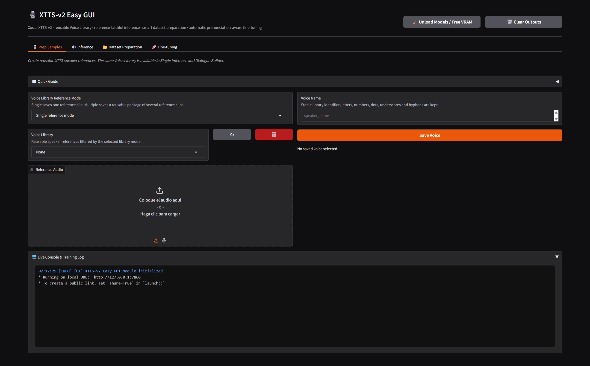
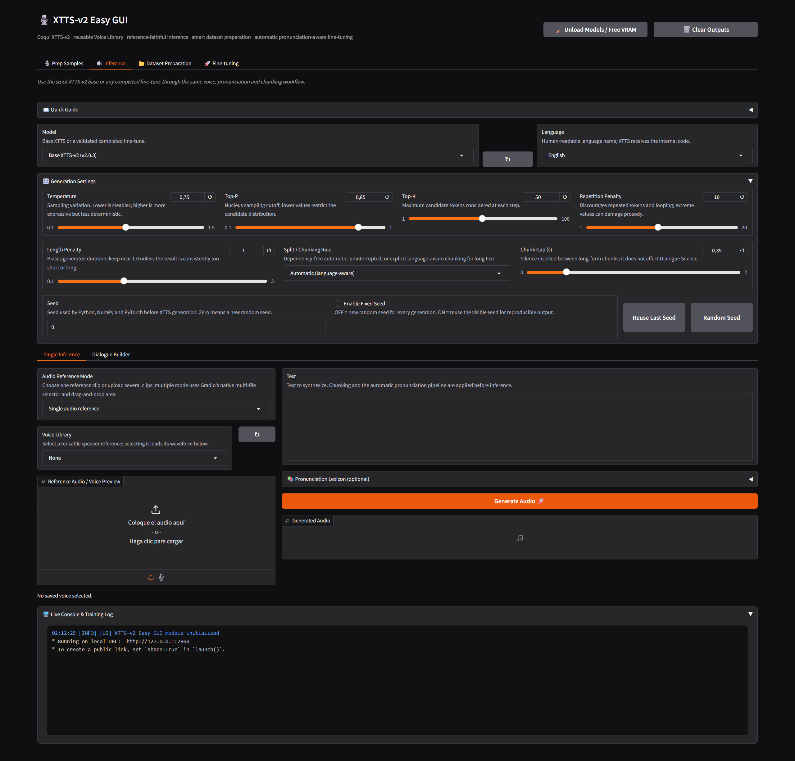
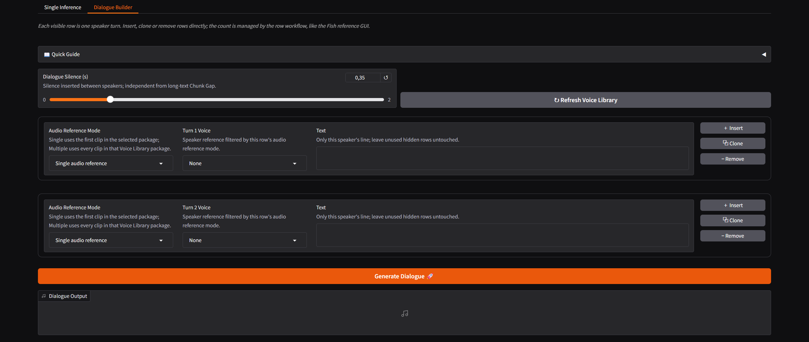
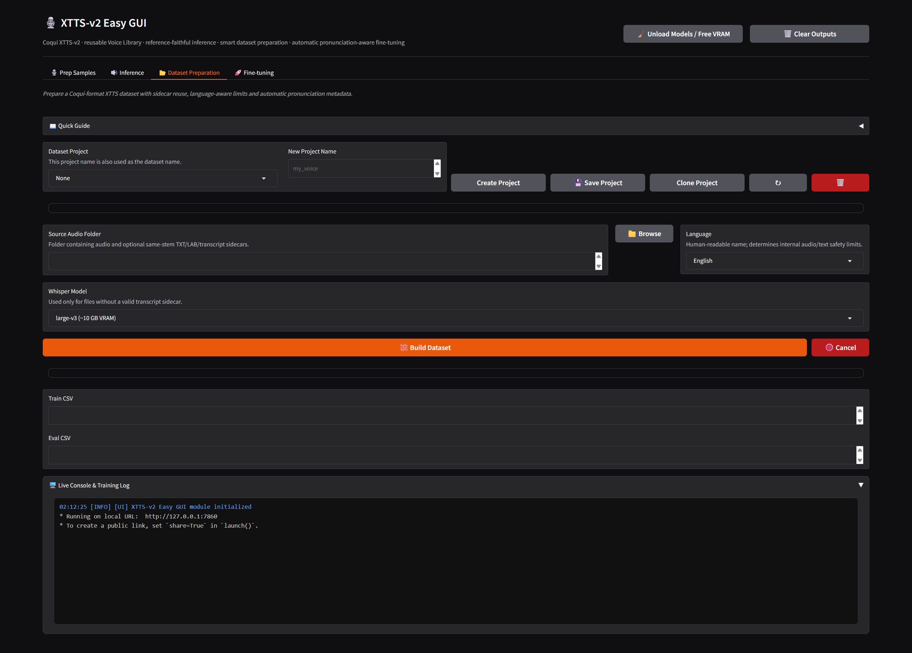
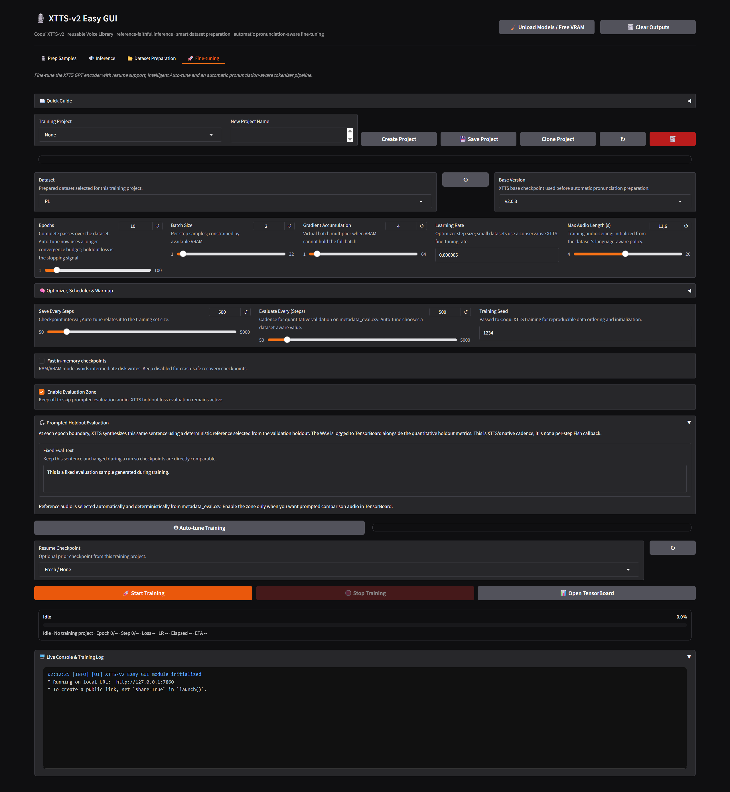

## 🎙️ XTTS-v2 Easy GUI

A Windows-first Easy GUI for **Coqui XTTS-v2**. It combines native XTTS inference, reusable single and multiple-reference Voice Library packages, language-aware long-form chunking, project-based dataset preparation, automatic pronunciation/BPE preparation, complete GPT-encoder fine-tuning, prompted evaluation and TensorBoard monitoring in one Gradio application.

> [!IMPORTANT]
> **XTTS fine-tuning produces a complete model checkpoint.** This project does not train or load PEFT/LoRA adapters. **Prodigy is an optional optimizer only**; it does not turn XTTS into adapter training and does not reduce the final model to a small delta file.
>
> Fine-tuning is experimental. It can improve speaker consistency for a specific dataset, but it can also damage pronunciation, prosody, stability, generalization or zero-shot behavior. Always compare a trained checkpoint against the untouched base model using the same reference audio and test sentences.

---

## 🪟 Windows installation

Clone the repository or download as a .zip file:

```cmd
git clone 
```

Then run the installer from this folder:

```cmd
install.bat
```

The installer is idempotent and keeps the runtime inside the project. It does not depend on a global Python installation and does not delete an existing model, dataset or project when it is run again.

The managed stack includes:

- project-local `uv 0.11.33`;
- Python `3.11.15`;
- PyTorch `2.8.0` with CUDA 12.8 wheels;
- Coqui TTS `0.27.2` and Coqui trainer `0.3.1`;
- Gradio, TensorBoard, Faster-Whisper, Hugging Face Hub and the local audio stack;
- `prodigyopt==1.1.2` for the optional Prodigy optimizer;
- tokenizer, BPE-expansion and dataset utilities used by the automatic pronunciation pipeline.

The installer also runs an import smoke test for PyTorch, XTTS and Prodigy. This confirms that the project environment is structurally available; it does not replace a real GPU inference or training test.

XTTS-v2 base assets are downloaded on demand from [coqui/XTTS-v2](https://huggingface.co/coqui/XTTS-v2) into `base_models/`. Review the model card and applicable Coqui/CPML terms before redistribution or commercial use.

Optional `ffmpeg.exe` enables additional input formats. WAV and FLAC remain supported without it.

---

## ▶️ Launch

After installation:

```cmd
start.bat
```

The launcher uses the project-local Python environment and starts Gradio at:

```text
http://127.0.0.1:7860
```

The browser opens automatically. The environment is not reinstalled on every launch.

---

## 🧠 XTTS-v2 architecture and training scope

XTTS-v2 is a speaker-conditioned text-to-speech system with a GPT-style autoregressive text/audio token generation stage, speaker conditioning, DVAE/audio representation assets and a waveform decoder path.

This GUI follows the installed Coqui training path:

- inference loads a complete compatible model directory;
- fine-tuning updates the XTTS GPT encoder/model weights;
- `model.pth` and the matching `vocab.json` are published together;
- an expanded tokenizer is never used with an unresized checkpoint;
- the final model is listed in Inference with the `Trained · ...` prefix;
- PEFT/LoRA training and adapter-only inference are intentionally not exposed.

Prodigy is available as an experimental alternative to AdamW. It is an adaptive optimizer, not a scheduler: its documented input uses `lr=1.0`, normally with no external scheduler, and the GUI reports the effective adaptive LR and D estimate during training. AdamW remains the default and Auto-tune keeps AdamW as the validated baseline.

---

## 🖥️ Interface

The application has four workflow tabs and one shared live console.

## 1. 🎙️ Prep Samples



Creates reusable speaker references for inference and Dialogue Builder.

### Single reference mode

Stores one reference audio file under a stable Voice Library name.

### Multiple reference mode

Uses Gradio's native multi-file selector and drag-and-drop area to create a reusable package. The Voice Library keeps single references and multiple-reference packages as separate instances, so the corresponding dropdown only displays compatible entries.

The tab includes:

- Voice Library refresh;
- upload or microphone input;
- multiple-file package creation;
- waveform/audio preview when a saved entry is selected;
- package deletion without affecting other entries.

Whisper is not used in Voice Library preparation. A reference package is only a speaker-conditioning asset; its audio does not need a training transcript for inference.

Clean speech with limited noise, reverb, music and overlapping speakers gives more stable conditioning.

---

## 2. 🔊 Inference



Inference loads either a stock XTTS-v2 model or a completed local fine-tune. The model dropdown directly discovers valid base models and `training/*/ready/` model directories.

### Language and generation

Languages are displayed by their human-readable names and start at **English**. XTTS receives the internal language code only after selection.

Generation controls include:

- Temperature;
- Top-P and Top-K;
- Repetition Penalty;
- Length Penalty;
- dependency-free automatic or explicit sentence/paragraph/line/fixed chunking;
- Chunk Gap between long-form segments;
- fixed/random/reuse seed controls.

The default automatic splitter does not require `spacy`. Long-form text is segmented internally using the selected language-aware policy.

### Single audio reference

Uses one selected or uploaded reference audio. Selecting a Voice Library entry loads its audio into the waveform preview before generation.

### Multiple audio reference

Uses every audio file in a saved package or every file selected in Gradio's native multi-file area. The Voice Library dropdown is filtered so that single references do not appear in multiple-reference mode.

### Pronunciation Lexicon

The optional **Pronunciation Lexicon JSON** is inside a closed accordion so it does not distract from normal inference. It performs deterministic text substitutions before XTTS tokenization.

Example:

```json
{
  "replacements": {
    "API": "a pe i",
    "XTTS": "ex te te es"
  }
}
```

Leave it empty when no custom substitution is needed. The internal pronunciation pipeline still runs for trained models and datasets.

### Dialogue Builder



Dialogue Builder supports multiple turns with independent text, voice and **Audio Reference Mode** per row. Each row can select a single reference or a multiple-reference package. Insert, Clone and Remove operations are available without exposing a redundant manual turn-count slider.

Global generation settings apply to every turn. **Chunk Gap** affects long text inside one turn; **Dialogue Silence** affects the gap between speakers.

---

## 3. 📂 Dataset Preparation



Dataset Preparation is project-aware. The Dataset Project name is reused as the dataset name and is synchronized into Fine-tuning after successful preparation.

The builder:

- normalizes supported audio into the XTTS training format;
- uses an existing same-stem `.txt`, `.lab` or `.transcript` sidecar when available;
- does not transcribe a file when a valid paired transcript already exists;
- invokes Faster-Whisper only for audio without a usable sidecar;
- applies internal language-aware minimum duration, maximum duration, text-length and evaluation policies;
- creates Coqui-compatible `metadata_train.csv` and `metadata_eval.csv`;
- writes a dataset manifest describing reuse, ASR usage, limits and pronunciation state;
- carries a source-sidecar `pronunciation_lexicon.json` into training when present.

The GUI does not expose fragile `min`, `max` and evaluation-fraction sliders. These values are inferred from language, dataset size and the XTTS training constraints.

### Dataset output

```text
datasets/<dataset>/
├─ metadata_train.csv
├─ metadata_eval.csv
├─ dataset_manifest.json
├─ lang.txt
├─ pronunciation_lexicon.json        # optional
└─ wavs/
```

Existing audio/transcript pairs are reused whenever possible. Dataset preparation does not silently replace a valid transcript with ASR output.

---

## 4. 🚀 Fine-tuning



> [!WARNING]
> Fine-tuning is optional and experimental. It trains a complete XTTS-compatible model, not a LoRA adapter. A longer run is not automatically a better run; use quantitative holdout loss, prompted evaluation audio and manual pronunciation checks together.

Fine-tuning uses a prepared dataset and a selected XTTS base version. The workflow automatically runs the pronunciation preparation pipeline before starting the worker.

### Automatic pronunciation and BPE expansion

The pipeline is always available internally; there is no separate tokenizer tab.

1. The dataset is analyzed for BPE/tokenization hotspots.
2. Only justified whole-word or technical entries are added to the tokenizer.
3. The XTTS text embedding and text head are resized together.
4. The expanded `vocab.json` and matching `model.pth` are validated as a pair.
5. The lexicon and tokenizer are carried into `ready/` and used by inference.

The expansion uses tokenizer `added_tokens` rather than replacing the base merge table. This preserves the stock XTTS BPE behavior while making selected names, acronyms, accented words and technical terms trainable as complete entries. It is not a pronunciation guarantee: accurate transcripts, representative data and holdout evaluation remain necessary.

### Auto-tune

Auto-tune uses dataset size, language-aware audio limits and available VRAM to propose:

- epochs and effective batch size;
- gradient accumulation;
- learning rate;
- optimizer and optimizer parameters;
- scheduler, warmup and scheduler cadence;
- checkpoint and evaluation cadence;
- maximum audio length.

AdamW remains the automatic baseline. Prodigy can be selected explicitly for a controlled A/B experiment.

### Optimizers

Available choices are AdamW, Adam, RAdam, RMSprop, SGD and Prodigy.

Prodigy is configured as an adaptive optimizer:

```json
{
  "betas": [0.9, 0.999],
  "eps": 1e-8,
  "weight_decay": 0.0,
  "decouple": true,
  "use_bias_correction": false,
  "safeguard_warmup": true,
  "d0": 1e-6,
  "d_coef": 0.5,
  "slice_p": 11
}
```

When Prodigy is selected, the GUI uses `lr=1.0` as the adaptive scale input and defaults to **None (optimizer-managed)** instead of imposing an AdamW-style decay schedule. Prodigy state is included in the rolling recovery checkpoint, so a resumed run restores its optimizer statistics when the checkpoint is compatible.

### Schedulers and warmup

The installed Coqui/PyTorch trainer supports:

- None (optimizer-managed);
- MultiStepLR;
- CosineAnnealingWarmRestarts;
- CosineAnnealingLR;
- ExponentialLR;
- StepLR;
- ConstantLR;
- LinearLR;
- PolynomialLR;
- OneCycleLR;
- CyclicLR.

Schedulers advance per optimizer update by default, so gradient accumulation does not silently multiply the requested warmup or decay horizon. Per-epoch cadence remains available for schedules where it is more appropriate.

### Fresh / Resume

**Fresh / None** starts a new worker run. **Resume Checkpoint** uses a compatible rolling recovery checkpoint and restores model, optimizer and scheduler state when available. Do not resume a checkpoint with a different tokenizer, base checkpoint or optimizer topology.

### Checkpoint I/O

The default disk policy minimizes repeated full-model copies:

- one rolling `checkpoint.pth` containing recovery state;
- one model-only `best_model.pth` snapshot;
- one final exported `ready/model.pth`.

RAM mode keeps the best model weights in system memory and writes the final model once. VRAM mode keeps the best snapshot in GPU memory when possible and falls back to RAM if necessary. These modes are faster but do not provide crash-safe intermediate recovery.

### Evaluation Zone

Quantitative holdout evaluation from `metadata_eval.csv` remains active in the trainer. The optional Evaluation Zone additionally keeps one deterministic validation reference and one fixed sentence, then synthesizes a prompted WAV at epoch boundaries for TensorBoard comparison.

### Progress, logging and TensorBoard

The GUI provides:

- an HTML progress bar with phase, epoch, step, loss, LR, elapsed time and ETA;
- immediate Start/Stop button state changes;
- a live console that mirrors worker output to `training/<project>/training.log`;
- detailed worker messages for dataset loading, tokenizer validation, checkpoint policy, optimizer creation, evaluation and export;
- automatic TensorBoard launch for the current project run only.
- a non-blocking completion chime for successful inference, dialogue, dataset preparation, transcription and training.

Prodigy progress reports its effective adaptive learning rate and current D estimate rather than displaying `1.0` as if it were a conventional XTTS LR.

---

## 🧩 Finished-model inference

Finished models are published under:

```text
training/<project>/ready/
├─ model.pth
├─ config.json
├─ vocab.json
├─ speakers_xtts.pth
├─ dvae.pth
├─ mel_stats.pth
├─ reference.wav
├─ training_manifest.json
└─ pronunciation_lexicon.json     # when available
```

Inference validates the required complete model artifacts and the tokenizer/checkpoint vocabulary dimensions before loading. A trained model appears in the model dropdown as `Trained · <project>` with its language when available.

The GUI does not load PEFT/LoRA deltas. A Prodigy-trained run is still a complete fine-tuned XTTS model.

---

## 🎛️ Memory lifecycle

**Unload Models / Free VRAM** releases the loaded XTTS model, ASR state, Python references and CUDA caches. Starting training uses a separate worker process and does not intentionally share a resident inference model.

The audio path uses the local soundfile decoder first and a guarded fallback for formats that require it, avoiding the known torchaudio migration warning in the normal WAV path.

---

## 📊 Shared console and status

The shared Live Console mirrors application and training lifecycle messages. Training status includes project, phase, worker state, progress file and log path. The persistent project files keep Dataset and Training surfaces synchronized without storing runtime binaries in source control.

---

## 📂 Important directories

```text
XTTS-v2-Easy-GUI/
├─ app.py
├─ xtts_backend.py
├─ xtts_easy/
│  ├─ projects.py
│  ├─ train_worker.py
│  └─ console.py
├─ install.bat
├─ install.ps1
├─ start.bat
├─ README.md
├─ LICENSE
├─ .venv/                 # local Python environment
├─ .runtime/              # uv, downloads, temporary files and HF cache
├─ base_models/           # downloaded XTTS base assets
├─ models/                # local model assets, if used
├─ samples/               # Voice Library entries
├─ outputs/               # generated inference/dialogue audio
├─ datasets/              # prepared datasets
├─ projects/              # Dataset and Training project state
├─ training/              # runs, checkpoints, TensorBoard and ready models
└─ assets/                # small local runtime assets
```

Generated directories and model/audio artifacts are excluded from publication by `.gitignore`. The source repository should contain application code, installer scripts, documentation, license text and small non-user-specific assets only.

---

## 🧪 Recommended workflow

1. Install with `install.bat` and launch with `start.bat`.
2. Test the stock XTTS model with a clean reference audio.
3. Create a Voice Library single reference or multiple-reference package.
4. Use Single Inference and Dialogue Builder before training to establish a base-model comparison.
5. Prepare a consistent single-speaker dataset with paired transcripts whenever possible.
6. Select the dataset in Fine-tuning and run Auto-tune.
7. Start with AdamW and enable the Evaluation Zone when prompted comparison audio is useful.
8. Use Prodigy only as a controlled A/B experiment with the same dataset, seed, reference and evaluation text.
9. Compare checkpoints against the untouched base model for pronunciation, prosody, stability and generalization.
10. Keep the earliest checkpoint that genuinely improves the target voice without introducing regressions.

---

## ⚠️ Practical limitations

- A successful installer/import smoke test does not prove complete live GPU inference or fine-tuning.
- CPU fallback is useful for structural checks but is not a practical replacement for CUDA training.
- Full XTTS fine-tuning stores complete model weights; Prodigy does not change that model format.
- Prodigy is an experimental optimizer in this XTTS workflow and is not the Auto-tune default.
- Fixed seeds improve reproducibility but do not guarantee bit-identical output across devices, kernels or backend versions.
- Automatic BPE expansion and a pronunciation lexicon improve control but cannot compensate for inaccurate transcripts or poor reference audio.
- The first model load and first generation can be substantially slower because XTTS assets are downloaded and initialized on demand.
- Follow the licenses and terms of XTTS-v2, Coqui TTS and every installed third-party dependency.

---

## 🔗 Upstream / acknowledgements

The workflow and visual hierarchy are informed by:

- [Coqui XTTS-v2](https://huggingface.co/coqui/XTTS-v2);
- [Coqui TTS](https://github.com/idiap/coqui-ai-TTS);
- [daswer123/xtts-webui](https://github.com/daswer123/xtts-webui);
- [AllTalk TTS](https://github.com/erew123/alltalk_tts);
- [Prodigy](https://github.com/konstmish/prodigy).

This project contains original Windows installer, GUI glue, dataset, pronunciation and training integration code. It does not relicense upstream model weights or upstream packages.

---

## License

See [LICENSE](LICENSE). XTTS-v2 weights and upstream Coqui code remain subject to their own licenses and model terms.
